# <p align="center">✨Obsidian Discord✨</p>

**_<p align="center">🪄 A theme for Discord based on the Obsidian color scheme + a few extras</p>_**

### <p align="center">

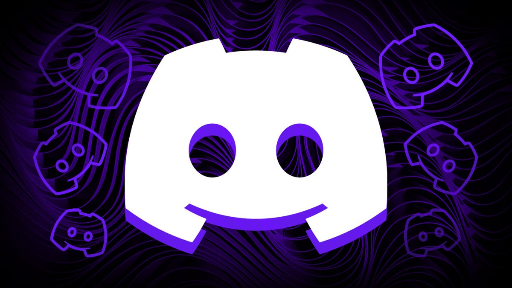
</p>

## Files

#### ObsidianDiscordAll.theme.css

[](https://mattymroz.github.io/ObsidianDiscord/ObsidianDiscordAll.theme.css)

#### ObsidianDiscordThemeOnline.css

[](https://mattymroz.github.io/ObsidianDiscord/ObsidianDiscordThemeOnline.css)

#### ObsidianDiscordThemeLocal.css

[](https://mattymroz.github.io/ObsidianDiscord/ObsidianDiscordThemeLocal.css)

#### Browser - No configuration

```
@import url(https://mattymroz.github.io/ObsidianDiscord/ObsidianDiscordThemeOnline.css);
```

## 👀 Demonstration

### <p align="center">📸 Obsidian Discord</p>

<p align="center">
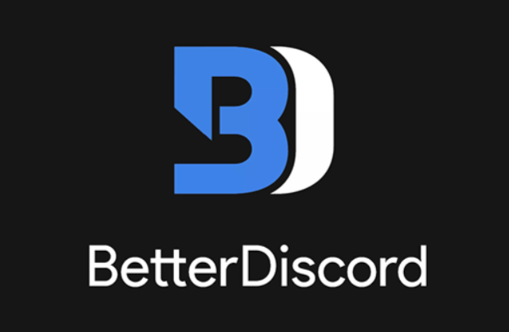
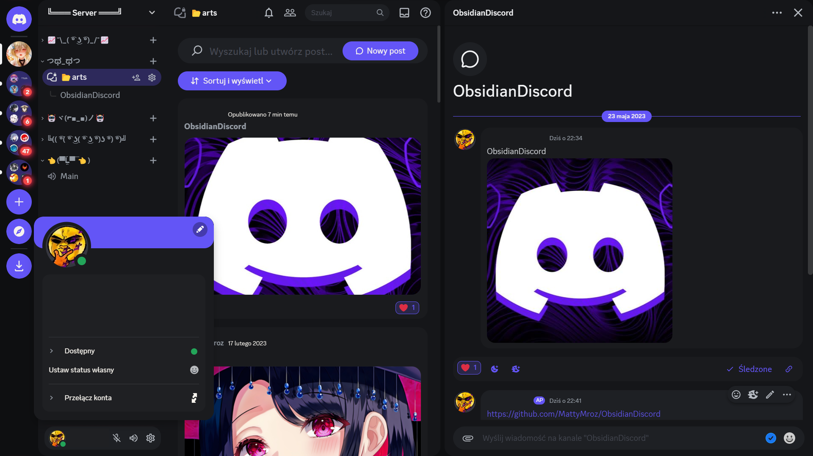
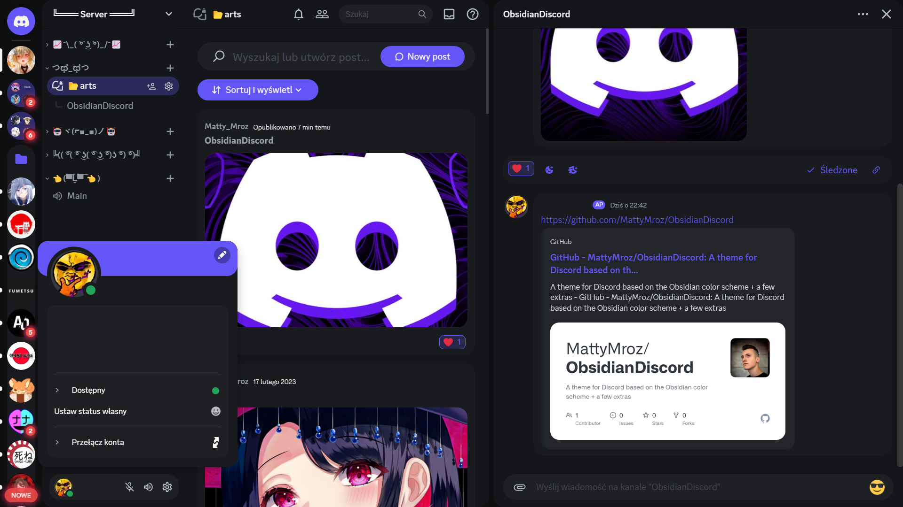
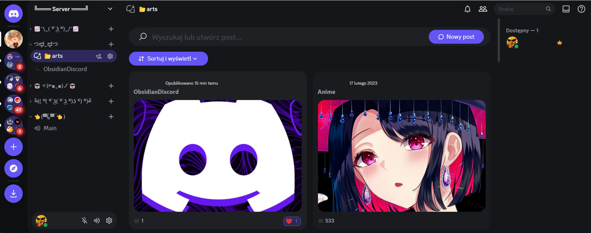
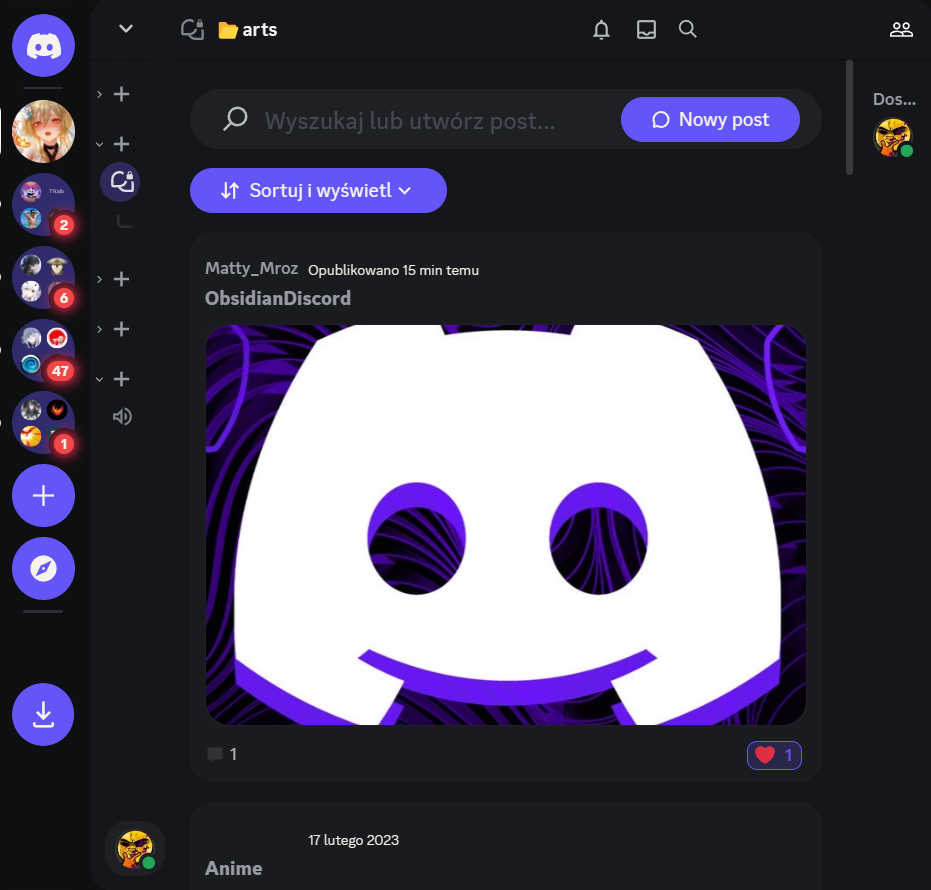
</p>

### <p align="center">⚡ Installation – BetterDiscord</p>

<p align="center">
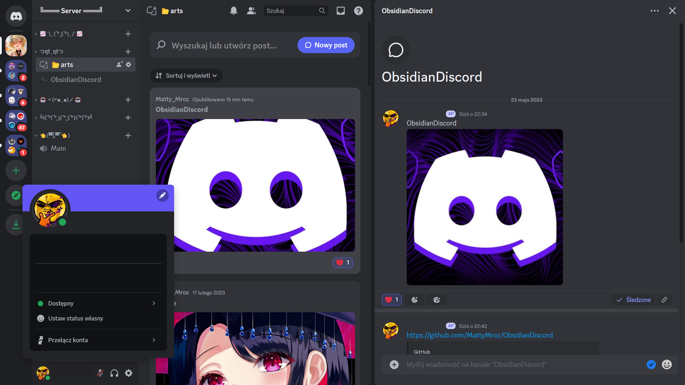
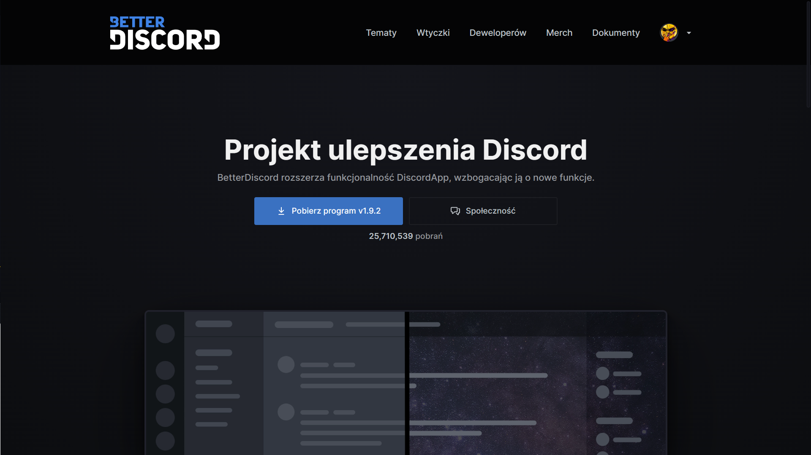
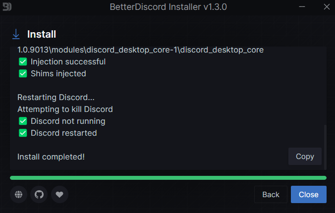

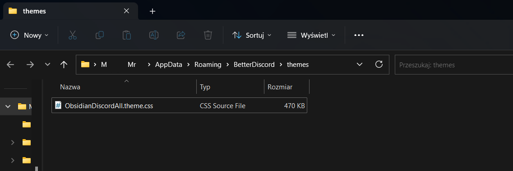

</p>

### <p align="center">⚡ Browser - Configuration</p>

<p align="center">
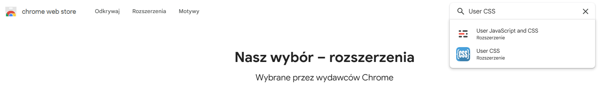
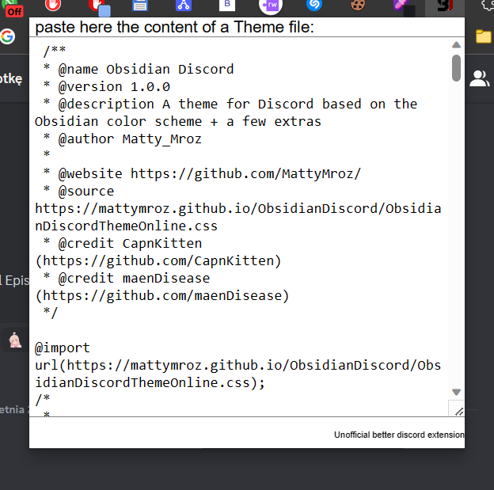
</p>
