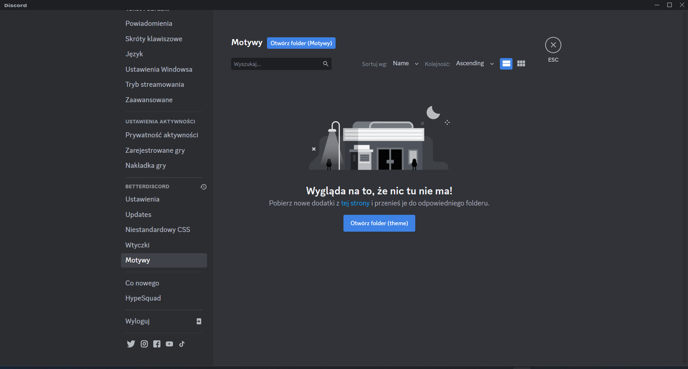

# <p align="center">✨Obsidian Discord✨</p>

**_<p align="center">🪄 A theme for Discord based on the Obsidian color scheme + a few extras</p>_**

### <p align="center">


</p>

## Files

#### ObsidianDiscordThemeOnline.css

[](https://mattymroz.github.io/ObsidianDiscord/ObsidianDiscordThemeOnline.css)


#### CSS IMPORT

```
@import url(https://mattymroz.github.io/ObsidianDiscord/ObsidianDiscordThemeOnline.css);
```

**❗❗❗Better Responsiveness Is No Longer Supported❗❗❗**


## 👀 Demonstration

### <p align="center">📸 Obsidian Discord</p>

<p align="center">


</p>

### <p align="center">⚡ Installation – BetterDiscord</p>

<p align="center">





</p>

### <p align="center">⚡ Browser - Configuration</p>

<p align="center">

To use this script, you'll need to install the Tampermonkey extension. You can get it from the Chrome Web Store:

[](https://chromewebstore.google.com/detail/tampermonkey/dhdgffkkebhmkfjojejmpbldmpobfkfo)

Once you have Tampermonkey installed, you can download and install the script from the following link:

[](https://raw.githubusercontent.com/MattyMroz/ObsidianDiscord/main/ObsidianDiscord.js)

</p>